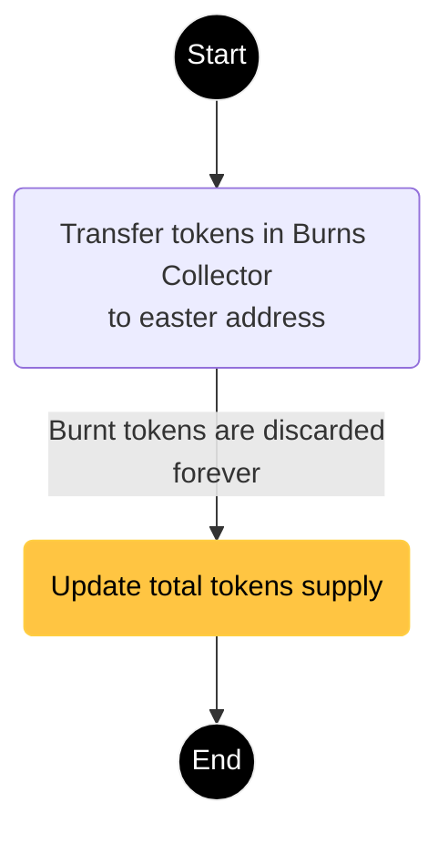

# Burning Process

At the end of the pool, the Burns collector contains a
certain amount of tokens that will be deducted from the
total supply and discarded forever.

Since the idea of the project is to produce value, we believe
that this autonomous burning process is the greatest way to
maintain a good market impact and to prevent token
deflation.

Even though the risk of losing value is likely common in the
cryptocurrency world, our algorithms along with a process
mainly controlled by holders will help prevent or at least
minimize those risks.

--8<-- "includes/abbreviations.md"