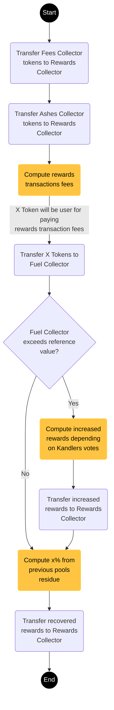

# Rewarding Process

The ending of a pool will automatically trigger the ending of the participation process. Thus, holders can’t engage
anymore tokens and the rewarding process starts. All the pool data are saved in the blockchain to prevent false
information and to maximize the security of the pool system.

The immutable data will allow us to define the rewards to be given to each participant. The first phase includes
merging all sources of rewards such as the *Fees collector*, the *Ashes collector* and the *Fuel collector* into the *Rewards collector*.
In this part of the algorithm, we refer to the voting results to gather the extra rewards from the *Fuel
collector*.

Some fees are applied to the collected tokens, those fees will go back to the *Fuel collector* and may be used to pay
the network transaction fees once the top rewarded Kandlers are announced.

<!-- End pool diagram -->

After identifying the final prize to be shared among participants, a sorting algorithm is invoked to rearrange the
holders’ addresses depending on the number of tokens engaged in that pool. This will help us determine easily the
top rewarded Kandlers.

The maximum rewards multiplier is a parameter defined in the smart contract that limits the number of rewarded
tokens. Using this multiplier, we efficiently manage the distribution of the rewards among Kandlers and the
resulting prize is proportional to the engaged number of tokens. The number of the top rewarded Kandlers is also a
parameter defined in the smart contract.

The top rewarded Kandlers will have a higher rewards multiplier whereas other rewarded Kandlers will have a lower multiplier that
ensures a minimum satisfying prize at the end of the pool.

<!-- TODO: Add diagram -->

!!! info "Pool Exclusion: an anti-whale mechanism"

    To prevent crypto whales from manipulating pools and from being always listed among top rewarded kandlers, we
    developed an anti-whale mechanism that implies an exclusion of top rewarded Kandlers from `X` next pools. The `X`
    parameter is also defined in the smart contract and can change upon a mutual discussion with our community of
    holders.

--8<-- "includes/abbreviations.md"